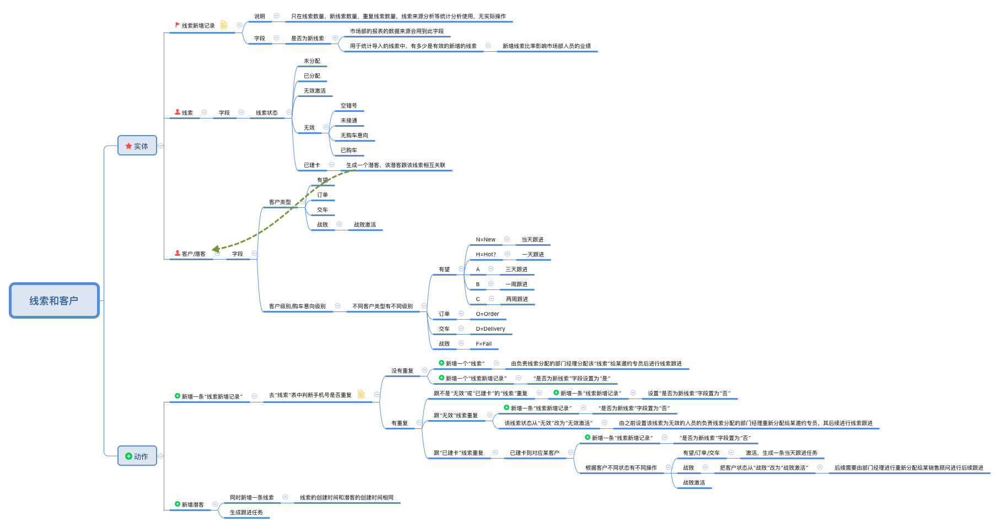

# crifan的折腾精神、学习能力和逻辑能力的体现

* 最后更新：`20221028`

---

[toc]

---

## 说明

* 内容说明
  * 此文档专门用于整理出相关内容，以体现出[crifan](http://www.crifan.com/)的`折腾精神`、`学习能力`、`逻辑能力`、`做事情效率高`等各方面的技术能力
* 本文目的
  * 证明自己的特长
    * 逻辑性比较强
    * 有足够技术敏感度
    * 有很强的折腾精神
    * 善于总结
  * 从而才能
    * 能够快速学习新的技术
    * 善于和能够解决复杂的技术问题
    * 找到问题的根本原因
      * 追根溯源
    * 能想办法提高做事情的效率
      * 详见：
        * [如何提高工作效率](https://book.crifan.o'r'g/books/improve_work_efficiency/website/)
    * 总结出
      * [技术学习的思路和方法的经验与总结](https://book.crifan.org/books/learn_tech_method_experience/website/)
      * 和其他各种技术和非技术的教程
        * [Crifan的电子书的使用说明](https://github.com/crifan/crifan_ebook_readme)
* 内容历史
  * 之前最早是发布在[crifan的折腾精神 – 在路上](https://www.crifan.com/crifan_spirit_of_get_to_the_bottom/)
  * 现在合并整理到此文档
    * 加上其他部分，如学习能力、逻辑能力等
* 发布形式
  * 代码仓库：
    * https://github.com/crifan/crifan_play_learn_logic_spirit
      * 源码是：`README.md`
  * HTML：`README.md` 生成 `README.html` 改名 `index.html`）
    * 文件：https://github.com/crifan/crifan.github.io/blob/master/crifan_play_learn_logic_spirit/index.html
    * 在线查看页面：https://crifan.github.io/crifan_play_learn_logic_spirit/
      * 会自动跳转到：https://crifan.github.io/crifan_play_learn_logic_spirit/index.html
  * PDF：`README.md` 生成 `README.pdf` 改名 `crifan_play_learn_logic_spirit.pdf`）
    * 文件：https://github.com/crifan/crifan_play_learn_logic_spirit/blob/master/crifan_play_learn_logic_spirit.pdf
    * 下载：https://raw.githubusercontent.com/crifan/crifan_play_learn_logic_spirit/master/crifan_play_learn_logic_spirit.pdf

## crfian的学习能力

### 折腾IP代理池的过程

第一次折腾IP代理池时，对于各种相关概念不了解，连想要选购合适产品都不容易。

但是通过一些IP代理池服务商的网站产品的简单介绍：

* 【已解决】找个好用的IP代理池实现防止大众点评网站的反扒

自己悟出和理解出相关含义和区别，并整理出来了：

* 【已解决】搞懂IP代理池相关概念和逻辑

然后就可以购买和使用合适自己需求的代理了：

* 【已解决】购买多贝云IP代理池
* 【已解决】用Python代码测试多贝云代理IP是否生效
* 【已解决】PySpider中使用多贝云IP代理池实现每次请求IP都不同

### 快速整理数控系统相关知识

之前不了解数控系统，得知一需求是系统找个开源的cad系统，集成到现有数控系统。

经过简短（1，2小时级别的）整理后，即可：

* opencad不是所需要的cad的开源系统
  * 最适合的开源cad系统之一是：freecad
* 能搞懂freecad大概是什么以及一些核心功能和逻辑
* 以及清楚移植的大概思路和步骤和最终效果

详见：

* 【整理】开源cad系统相关资料
* 【整理】freecad简介和移植freecad的大概思路和步骤

### 快速整理华为LiteOS基本资料

从没听过LiteOS，到有人问，自己花点时间简单搜索和整理后，即可整理出相关基本资料：

【整理】华为物联网操作系统：Huawei LiteOS

-》证明自己的搜索资料能力、整理和归纳资料能力、逻辑和结构能力还不错。

## crifan的折腾精神==解决复杂问题的能力

下面整理出crifan的折腾各种复杂问题的过程。

其中部分内容额外体现了需要：

* 有足够的细心
* 一定的技术敏感度
* 开拓的思路

才容易从发现问题细节，找到问题根源，最终解决问题。

### 硬件

#### Netgear R6220路由器 变砖尝试修复的过程

虽然最后没有把变砖的路由器救活，但是期间能够从网上繁杂的信息中，找到真正的串口的位置，以及最终买电烙铁和找到并买到合适的ttl的线，也算是不容易了。

详见：

* [【未解决】尝试通过接串口和重新刷机去修复变砖的Netgear R6220路由器](https://www.crifan.com/try_via_serial_port_reburn_router_fix_brick_netgear_r6220_router)

### 嵌入式

#### 交叉编译

##### 对于cygwin下编译buildroot时libtool的配置期间出错的折腾

先后尝试了可算达到上百个点了。

相比而言，之前的折腾时遇到比较多的，也就三五十个尝试的点，也就把问题搞定了。

期间有几次都打算放弃了，但是后来还是坚持继续找问题原因，最终功夫不负有心人，终于搞定了：

详见：

* [【已解决】cygwin下make编译buildroot时在libtool-2.2.10时出错：configure: error: C compiler cannot create executables](https://www.crifan.org/cygwin_buildroot_make_libtool_2_2_10_configure_error_c_compiler_cannot_create_executables/)
* [【已 解决】再次研究：Cygwin下编译Buildroot时在编译libtool-2.2.10时出错：/usr/lib/gcc/i686-pc- cygwin/4.7.3/cc1.exe: error while loading shared libraries: ?: cannot open shared object file: No such file or directory](https://www.crifan.org/cygwin_buildroot_cc1_exe_error_while_loading_shared_libraries_cannot_open_shared_object_file_no_such_file_or_directory/)
* [【记 录】第三次去研究：Cygwin下编译Buildroot时在编译libtool-2.2.10时出错：/usr/lib/gcc/i686-pc- cygwin/4.7.3/cc1.exe: error while loading shared libraries: ?: cannot open shared object file: No such file or directory](https://www.crifan.org/cygwin_buildroot_usr_lib_gcc_i686_pc_cygwin_4_7_3_cc1_exe_error_while_loading_shared_libraries_cannot_open_shared_object_file_no_such_file_or_directory/)

### 上层软件

#### iOS逆向

##### 实现抖音反越狱检测，使得成功点赞和关注

现象：

希望实现iOS版抖音的反越狱检测，最终实现越狱iPhone手机中的抖音新注册账号可以点赞和关注

注：普通越狱手机，新注册抖音号，无法点赞和关注

折腾过程：

* 搞懂越狱插件开发的基本流程
  * 最开始，从theos都没听过，到网上找资料，无意间看到有人提到theos，到自己去找和研究theos，接着就是学习theos，搭建theos开发环境，去跑通插件开发环境
    * 当然，之后才慢慢清楚，CydiaSubstrate、MonkeyDev等更多的相关框架和工具
* 搞懂常见越狱手段有哪些
  * 从不知道越狱有哪些技术，到整理和学习了，几十种，几大类的检测越狱的各种手段
* 分别一一去实现反越狱的功能点
  * 先是去实现了常见的，基于文件的，文件是否存在，是否是软链接等等的各种函数
  * 以及还实现了其他的一些，比如dyld相关的，尤其是_dyld_image_count、_dyld_image_name等的hook
    * 始终无法实现抖音的反越狱
* 换思路，去逆向破解抖音，找具体的越狱检测相关代码和逻辑
  * 要点之一是：同事辅助用Choicy去Disable Tweak Injection抖音，结果竟然真的是：可以点赞和关注
    * 且此时明显和越狱文件是否存在这个方向，根本没关系
      * 且后续调试输出log也发现，关于越狱检测去检测文件的函数调用，本身就很少，即使调用，传入的越狱文件路径也很少，所以不太像是核心和主力的越狱检测
  * 具体研究包括2类
    * 静态分析：用IDA分析相关函数所属代码段
    * 动态调试：用（之前的debugserver+lldb，和后来的）XCode+MonkeyDev，去调试寻找可能的越狱检测相关逻辑
      * 也包括期间的：从没用过，但慢慢了解了基本的lldb的用法，尤其是从地址寻找相关所属动态库的代码段位置，从而能再去IDA中分析代码
      * 但是始终属于，在黑暗深林里摸索，没有看到一丝曙光，最主要是完全没有方向
* 里程碑进步：终于通过动态调试，从_dyld_get_image_name的上层调用函数中，找到了___lldb_unnamed_symbol148，从而去IDA中找到了_RxAnnotationInlineLoader的load
  * 然后去研究_RxAnnotationInlineLoader的load的hook
    * 但是依旧不行，直接hook忽略掉%orig代码逻辑，会导致抖音崩溃
  * 但是，开启了，动态调试研究抖音内部，在早期调用了哪些 越狱检测相关函数
    * 主要有：_dyld_register_func_for_add_image、sysctl的KERN_PROC_PID、dladdr、NSClassFromString等等
    * 从而：找到具体调用位置的上层，和AwemeCore相关的函数
    * 再去IDA中找对应的代码段，再去研究，到底有哪些越狱检测相关逻辑
    * 但是却由于ObjC的反汇编，IDA的伪代码，无法看出更多业务逻辑
    * 最多，也只能找到：只有一个getsectiondata比较有关系
      * 但是去直接hook了getsectiondata后，也没有解决问题
  * 算是：黑暗深林中看到一丝丝曙光，至少感觉方向，但是依旧没有更多进展
* 最终的胜利：getsectiondata和dladdr的配合hook
  * 之前虽已单独hook了getsectiondata，但是当时是dladdr已hook了，导致getsectiondata从dladdr解析后的动态库，已经是被hook后的返回的NULL，无法判断是否是jailbreak的dylib，导致最终无法完美hook
  * 最后是，在某次灵光乍现，想到了办法（去给dladdr加上地址偏移），去让getsectiondata调用dladdr，能让dladdr区分出，获取原始返回结果，用于getsectiondata得到dylib的name，判断是否是越狱库，从而看看是否有啥进展
  * 没报太大希望的前提下，去改了代码，实现了 getsectiondata+dladdr的配合hook，即getsectiondata中调用原始dladdr，其他地方调用被hook的dladdr，最终竟然：抖音反越狱就成功了，可以点赞和关注了
    * 期间其实还有其他很多困难，包括最后2022的2月前后，竟然抖音放开风控，不开启自己插件，也能点赞关注，导致无法测试自己插件是否真的生效了

最大的心得：

* 对解决技术问题，有足够的信心
* 有足够的技术敏感度
* 其他人的配合，有时候也会意想不到的帮助
  * 此处是：Choicy的Disable Tweak Injection测试结果，验证了，反越狱主要和 动态库注入有关，尤其明确了大方向，减少了战略找寻方向的时间
* 持之以恒的坚持

最终，所以再复杂的技术问题，都是可以搞定的，最多就是过程比较曲折而已。

##### iOS的tweak中hook syscall时可变参数传递始终异常最终发现是递归调用死循环

现象：

用Logos的%hookf去hook syscall函数，需要计算出原先可变参数的个数，传递给%orig的syscall函数。但是始终出错。

折腾过程：

* 最开始只是参考https://github.com/vtky/Swizzler逻辑，去计算syscall的可变参数
* 但是：本来期望的算出2个参数，却始终算出来是9个参数，以为是va_arg计算可变参数个数的逻辑不对
  * 不过也注意到细节：第一次是算出2个参数，之后始终算出是9个参数了
  * 但是试了重启项目，重启XCode，重启被测iPhone，重启Mac等各种手段，始终都是算出9个参数了
    * 都以为被测iPhone难道底层机制被破坏，导致无法正常调用syscall函数了？
  * 尝试了其他一些细节，比如把void *改为char *，问题依旧
* 后来：以为是tweak代码没生效
  * 因为输出的log，都是旧代码的log，而不是最新代码的log
    * 后记：是控制台在重新加载后，显示的是历史上所有的log，默认按时间排序后，最开始显示的始终是第一次的log
      * 以为是代码没生效呢
        * 其实是log日志看错了，把旧的以为是最新的
  * 以为是其他插件冲突，在卸载重装插件，重启iPhone等手段无效的前提下
  * 暂时禁用了其他插件，问题偶尔解决，偶尔又复现
* 再后来：继续研究参数为何始终是9个
  * 从stat64换其他比如stat去测试，发现第一次调用时的参数个数，有变化，比如是8个，后来偶尔出现正常的2个
  * 期间有个发现：此处竟然能用XCode去调试看到异常出错时的函数调用堆栈
  * 然后才有机会注意到：貌似此处的函数 _logos_function$_ungrouped$syscall(int, …) 被调用了3600多次
  * 才隐约感觉，或许是syscall被递归调用导致死循环了？
* 然后才想到，去研究Logos中的函数，为何没有递归调用死循环？
  * 才发现Logos是对于MSHookFunction的封装
    * 而MSHookFunction内部机制就是：
      * 函数：xxx
        * 会额外生成一个orig_xxx
        * 以及自己新写的函数
          * 比如：https://github.com/vtky/Swizzler 中是 replaced_xxx
          * 而Logos中生成的是：function_xxx
      * 举例：stat函数
        * orig_stat
        * function_stat
    * -》function_xxx，不会和orig_xxx重名，所以不会递归调用不会导致死循环
* 然后此处在Logos的%hookf中hook syscall的正确做法是：
  * 注：此处当syscall实现stat或stat64时，解析出可变参数个数是2个
  * 不能直接调用syscall
    * syscallRetValue = syscall(number, para1, para2);
      * 否则就会导致递归调用死循环
  * 而要借用%orig去调用
    * 由于syscall本身是可变参数，所以要先确保计算出正确的参数个数，再去调用%orig
      * 正确调用方式是：
        * syscallRetValue = %orig(number, para1, para2);
          * （待确认）内部其实就是
            * syscallRetValue = function_syscall(number, para1, para2);

核心要点：

* 幸好XCode能调试异常时tweak的代码，使得（后期才）能注意到是syscall发生了递归调用导致死循环
  * 否则没法调试，不知道内部出错的情况，很难想到是这个原因（这个思路，这条错误的方向）
    * 如果方向错误，是不可能找到原因并最终解决问题的
* 当然，也要加上
  * 自己有能力深究和验证自己的思路和推断
    * 比如：有能力研究Logos代码，搞懂内部函数的逻辑
      * 即从xxx函数，变成 orig_xxx和function_xxx
  * 以及：技术敏感度高
    * = 思路够广+ 能关联到之前的相关内容
    * 比如：能想到Swizzler 中是 replaced_xxx的写法
      * 从而辅助佐证了自己对Logos内部逻辑的判断，辅助确保了思路和方向是正确的

以上几条，缺一不可，否则都无法找到错误原因，无法解决问题

详见：

* 【未解决】C语言中如何获取到带三个点的函数中的可变参数
* 【已解决】C语言中解析获取计算出syscall函数可变参数的参数个数
* 【已解决】iOS的tweak插件syscall可变参数va_arg计算参数始终是9个参数
* 【已解决】iOS的绕过syscall的tweak插件已安装最新版但是代码不生效
* 【已解决】iOS的插件syscall的hook出错：原始的syscall函数没有被正常调用
* 【已解决】iOS的tweak插件去hook函数syscall出现递归调用死循环
* 【已解决】iOS的tweak插件Logos的%orig的实现原理如何规避绕开原函数的递归调用

#### Android逆向

##### 小花生的app的破解

* 最关键的前提：
  * v3.4.8
    * 没有被加固到
      * 否则dex导出了jar时（估计）就会报错
        * 不会这么轻易的导出可用的dex
    * 没有被混淆
      * 否则即使jar导出了源码，也无法看清原始代码中的加密逻辑
* 自己折腾过程中：
  * 关键点：
    * 在最新版v3.6.9用FDex2导出（200多B的无效的）dex无果后
      * 能想到去试试其他的旧版本
    * 以及在试试旧版本期间
      * v1.5虽然可以导出dex（dex导出jar，jar导出源码）
        * 主要是其中代码都是错误bad dex opcode
          * 无法找到源码
        * 其次是代码被混淆了
          * 即使找到，也不容易看清楚源码逻辑
  * 中等难度的地方
    * 如何搞清楚apktool和dex2jar、jd-gui等之间的关系
      * 搞清楚如何利用导出的文件，后续用什么工具，如何去处理
    * 如何正确的使用各种工具
      * root了的安卓 + XPosed
        * 用的是之前破解安卓app中https的ssl证书而搭建的环境：
          * 夜神安卓模拟器
          * XPosed
      * 再次基础上再去安装和使用工具
        * FDex2
          * 才能继续导出dex文件
        * 才能继续用夜神中文件管理器导出文件
          * 自己要解决夜神和mac的共享目录的问题
            * 【已解决】夜神安卓模拟器中导出文件到mac电脑
            * 【已解决】Nox夜神安卓模拟器中/mnt/shared对应Mac的共享目录在哪里
      * 最后才是用工具查看jar包，导出源码
        * 用jd-gui导出源码
          * 【已解决】mac版JD-GUI查看并导出jar包的java源代码
          * 也顺带去试了其他工具，比如：
            * jadx
            * Procyon：命令行工具
              * Luyten：基于Procyon的GUI工具
                * 【已解决】用基于Procyon的Luyten反编译安卓jar包得到java源码
    * 最终从v3.4.8的hook出的dex，dex转jar，jar导出源码，找到了J字段的解密逻辑

详见：

* [【已解决】Python实现小花生中addSignature的md5加密生成签名的逻辑](https://www.crifan.com/python_implements_md5_encryption_addsignature_generate_signature_logic)
* [【已解决】小花生app中调用接口parentChildReadingBookQuery2时timestamp和signature生成的逻辑](https://www.crifan.com/floret_born_app_call_interface_parentchildreadingbookquery2_timestamp_signature_generation_logic)
* [【记录】爬取小花生app中自主阅读馆和亲子阅读馆中的有音频的绘本数据](https://www.crifan.com/crawl_xiaohuasheng_app_self_reading_parent_child_reading_has_audio_storybook_data)
* [【已解决】为何Python中32字节的md值和小花生中getMD5Str计算出的md5值不同](https://www.crifan.com/why_32_byte_md_value_python_different_from_md5_value_calculated_by_getmd5str_python)
* [【已解决】小花生中如何得到getToken的计算逻辑以便得到正确的md5值可以正常请求接口](https://www.crifan.com/how_get_calculation_logic_gettoken_so_that_correct_md5_value_can_be_obtained_request_interface_normally)
* [【已解决】从不同版本的小花生apk中反编译出包含业务逻辑代码的dex和jar包源码](https://www.crifan.com/dex_jar_package_source_code_containing_business_logic_decompiled_from_different_versions_xiaoseng_apk)
* [【已解决】小花生安卓app的v3.4.8版破解后找到源码中是否包含J字段的加密逻辑](https://www.crifan.com/peanut_android_app_v3_4_8_version_cracked_find_whether_source_code_contains_j_field_encryption_logic)
* [【已解决】用Charles+Postman+Python解密脚本分析小花生app中绘本接口和返回信息](https://www.crifan.com/charles_postman_python_decryption_script_was_used_analyze_interface_picture_book_return_information_xiausheng_app)
* [【已解决】尝试破解小花生app安卓apk希望看到api返回的json中的J的解密算法得到明文](https://www.crifan.com/try_crack_xiaofang_app_android_apk_want_see_api_return_json_j_decryption_algorithm_get_plaintext)
* [【已解决】小花生app中api请求返回json的C，J，M，ST的含义和如何破解解密](https://www.crifan.com/c_j_m_st_json_api_request_app_how_decrypt_meaning)
* [【已解决】找小花生app的旧版本apk并尝试能否安装使用](https://www.crifan.com/find_old_version_xiaoseng_app_apk_try_install_use_it)
* [【已解决】PySpider中用Python代码爬取小花生app中绘本数据](https://www.crifan.com/pyspider_use_python_crawl_xiaohuasheng_app_storybook_data)
* [【已解决】从反编译小花生apk得到的包含业务逻辑代码中找到J字段解码的逻辑并用Python实现](https://www.crifan.com/decoding_logic_j_field_was_found_code_containing_business_logic_obtained_from_decompiled_xiaosang_apk_realized_python)

##### 搞懂少儿趣配音的请求中sign和auth_token参数值计算逻辑

能最终

* 如何计算auth_token的值
* 如何计算sign的值

主要过程是：

* 前提：之前有反编译安卓apk以得到源码的基础
  * 且同时用多种反编译方式
    * 从而从不同的角度，反推以找到真正的计算sign值的相关代码的位置
* 更主要的是
  * 从反编译后残缺的不完整的错乱的代码 + 加上对代码足够敏感：能顺藤摸瓜，找到相关计算逻辑
    * 入口点是先去搜/square/courseNature，找到确定的类包含对应api的host
    * 继续反推过程，其中找到FZNetApiManager.java
    * 通过代码加上自己的灵光一现的思路，推断auth_token可能是不变的
      * 经过重新登录app以确认推断auth_token是登陆后就不变的
    * 再去反推计算sign需要哪些参数：除了timestamp，是带uid和auth_token，以及额外的security_key的
    * 再去尝试理解java代码，搞清楚计算逻辑
      * 先排序，再key+value去合并字符串
    * 最终调用函数去计算
      * 该函数经过调研确定，就是java版本的md5值的计算，计算出32位字符串
* 最终再加上之前的python计算md5经验
  * 才能把java版的md5计算，转换出python的版本，计算出sign的值

详见：

* 【未解决】重爬少儿趣配音的所有视频
* 【已解决】用jadx破解出安卓apk少儿趣配音得到源码
* 【已解决】用dex转jar再转java的三步方式导出安卓app少儿趣配音的源码
* 【未解决】破解安卓应用少儿趣配音的源码以便于找到sign签名和auth_token的算法计算逻辑
* 【未解决】用Python代码实现少儿趣配音的请求参数sign的计算逻辑

##### 爬取趣配音APP的show的detail

* 除了基本的技能：
  * 利用之前的Charles+Nox，分析出如何获取到最全最多的show的detail的完整请求的顺序和参数等细节
    * 详见：【已解决】分析少儿趣配音APP中如何获取用户的show的逻辑
* 之外，还要有：
  * 足够的技术敏感度
    * 能想到，大量的401背后，可能是之前自定义taskid导致的
      * 从而才能最终找到根源，确保然后通过借助itag参数，确保新请求可以执行，而不是旧请求
        * 详见：【已解决】PySpider爬取趣配音一段时间后出现大量的异常401认证过期的请求
  * 善于利用现有资源
    * 在已知问题原因，需要对于重复的user去重，然后利用找PySpider资料，最终找到可以通过自定义taskid实现此目的
      * 详见：【已解决】PySpider中如何忽略部分参数去指定相同url以避免重复爬取而导致死循环

详见：

* 【已解决】PySpider代码写好但是始终无法爬取到show的detail
* 【已解决】PySpider中如何忽略部分参数去指定相同url以避免重复爬取而导致死循环
* 【已解决】PySpider爬取趣配音一段时间后出现大量的异常401认证过期的请求
* 【已解决】重爬少儿趣配音的所有用户的show
* 【已解决】分析少儿趣配音APP中如何获取用户的show的逻辑

#### Xcode

##### Xcode调试iPhone报错：Could not launch failed to get the task for process

现象：

XCode调试iOS的app到iPhone，结果报错：Could not launch，failed to get the task for process

折腾过程：

* 本以为很简单的，感觉是常见现象，所以去网上找资料，结果只能找到关于debug失效相关的一些设置
  * 自己都已经先后尝试过了，问题依旧
    * 期间还涉及到断点调试失效的问题的原因总结和回复了别人的帖子
      * [Why aren't Xcode breakpoints functioning? - Stack Overflow](https://stackoverflow.com/questions/64790/why-arent-xcode-breakpoints-functioning/69503397#69503397)
  * 且期间还会出现之前的：Unable to install 方面的问题
* 后来的后来，经过各种尝试，都无效
  * 调整和设置各种Code Signing参数
  * 调整和设置各种Provisioning Profile参数
  * 苹果开发者账号 = 开发者中心：调整、删除、重置各种配置
    * 包括ID、Certificate、Provisioning Profile等
  * 删除DrivedData
  * 重新建iOS的项目
  * 重启Mac
  * 重启XCode
  * 删除Provisioning Profile
  * 更换被测设备iPhone
  * 设置Legacy Build System
* 最后的最后：通过升级XCode（XCode 13.0升级到XCode 13.1），而解决了问题
  * 确认了问题根源：XCode 13.0自身的bug，无法正常给iOS的app生成Provisioning Profile

要点：

* 技术敏感度 = 能记住并联想到之前相关内容
  * 隐约记得之前XCode有过更新提示：XCode 13.1
    * 当时没去更新
  * 此处解决问题期间，怀疑是否是XCode的bug
    * 最后真的是通过升级了版本，而解决了问题
* 耐心
  * 在尝试XCode升级期间，由于网络不够好，下载很慢，先后消耗了1天多，最后才下载完毕和升级安装XCode的
    * 如果耐心稍等差一点，就放弃了更新XCode
      * 就无法解决此处问题了

详见：

* 【已解决】XCode调试iOS的app到越狱iPhone报错：Could not launch failed to get the task for process
* 【未解决】XCode中尝试解决failed to get the task for process：找证书和签名方面设置
* 【未解决】尝试解决XCode调试报错failed to get the task for process：重新安装XCode
* 【基本解决】搞懂XCode中Signing中Code Signing相关参数的逻辑
* 【已解决】Xcode中Signing的Code Signing Identity中Apple Development Mao Li(UBFSP2P5PM)中UBFSP2P5PM的含义和来源
* 【未解决】XCode报错failed to get the task for process：换另外iPhone7试试
* 【已解决】尝试解决XCode报错failed to get the task for process：XCode版本重装或升级

##### Xcode调试iPhone报错：Unable to install

现象：

* XCode调试iOS的app到iPhone报错：Unable to install
  * 详细信息是：A system application with the given bundle identifier is already installed on the device and cannot be replaced

折腾过程：

* 看起来是：已安装过app
  * 但是此处实际上已删除之前安装过的app，却出现此错误，很奇怪
    * 最后是重启iPhone，解决了此问题，但是又出现其他的于此相关的问题：
* iOSOpenDev的XCode调试iPhone6报错：Unable to install The application could not be verified
  * 去掉之前iOSOpenDev的XCode的各种设置（Run Script、User-Defined参数等），问题依旧。
  * 最终是：CODE_SIGNING_ALLOWED=NO，解决了证书问题
* 期间涉及到：code signing、证书Provisioning profile等方面问题，会导致：iPhone Developer no identity found
  * 尝试了Singin的参数Code Sign Identity、Code Sign Style、Provisioning Profile的各种组合，都不行
  * 会导致各种错误，包括Signing with codesign Apple Development: ambiguous matches Failed、iPhone Developer: no identity found
  * 也删除过Mac中钥匙串中的相关证书和秘钥
  * 也去撤销Revoke certificate过证书
  * 始终无法解决，最终：XCode重启，解决了此问题。。。

要点：

* XCode本身的内部的Code Sign的bug，会导致各种异常问题
  * 即使尝试了各种手段，也未必能解决
    * 只能靠XCode自己（重启）才能解决

详见：

* 【已解决】调试iOSOpenDev的XCode的iOS的app
* 【已解决】iOSOpenDev的XCode调试iPhone7报错：Unable to install A system application with the given bundle identifier is already installed on the device and cannot be replaced
* 【已解决】XCode中删除掉User-Defined的自定义参数
* 【已解决】iOSOpenDev的XCode调试iPhone6报错：Unable to install The application could not be verified
* 【已解决】iOSOpenDev的XCode项目编译报错：iPhone Developer no identity found
* 【未解决】XCode报错iPhone Developer no identity found：找签名证书配置方面问题
* 【记录】Mac中钥匙串中删除iOS的app的苹果开发相关证书


#### Python后端

##### 之前已发送成功的kafka消息数据丢失的原因

最后发现是之前默认参数配置是：数据只保留7天，所以超过时间，过期后，就会被删

虽然结论很简单，但是找原因和结论的过程，需要：

* 快速学习能力
  * 快速整理Kafka的基本的逻辑和原理
    * 尤其是segment的相关文件的命名，创建等逻辑
* 足够技术敏感度
  * 能从别人帖子中注意到，自己此处已有的配置参数中，数据被删应该和retention相关参数有关
    * log.retention.hours
* 深究问题的能力
  * 之后就可以根据此判断，深入研究retention的原理和机制
    * 最终确定是
      * log.retention.hours=168 导致过期被删问题
      * 而log.segment.bytes 只会导致超过大小后 新建segment
        * 而不会导致旧segment被删
          * 但是整个topic超过了log.retention.bytes应该会被删
            * 但是默认是-1，没限制，所以此处应该不是超过大小被删，而是过期被删

详见：
【已解决】kafka之前确定已保存的数据现在没了丢失了是怎么回事
【已解决】Kafka中数据被删和和被保留的策略和逻辑
【整理】学习Kafka基础知识和基本概念和逻辑

##### CentOS7中安装Python的pycurl和PySpider的pipenv的pycurl

期间各种折腾，遇到各种问题

* ModuleNotFoundError No module named pycurl
* ImportError pycurl libcurl link-time version (7.29.0) is older than compile-time version (7.64.1)
* ImportError pycurl libcurl link-time ssl backend (nss) is different from compile-time ssl backend (openssl)
  * 且此同一种问题反复出现多次

最后才发现，其实涉及到了多个环境：

* CentOS中`Python2`
* CentOS中`Python3`
* CentOS中`PySpider`中`pipenv`

最终解决问题的关键点之一是：

* 思路不要僵化
  * 通过仔细和思考或发现，当把curl变成openssl失败，行不通后
  * 转而考虑保留`curl`为`nss`，让`pycurl`配合弄成`nss`
    * 之后即可通过源码或`pip`安装出，版本匹配的，`nss`的`pycurl`
      * 最终`python`和`PySpider`的`pipenv`都可以`import pycurl`了

最后不仅解决了问题，还整理出心得了：

* 【整理】CentOS7中安装pycurl的心得

期间的过程详见：

* 【未解决】CentOS7中安装nss的PyCurl
* 【未解决】CentOS7中Pyspider运行出错：ModuleNotFoundError No module named pycurl
* 【未解决】CentOS7中卸载自带nss的curl并升级更换为openssl的curl
* 【已解决】CentOS7中PySpider运行出错：ImportError pycurl libcurl link-time ssl backend (nss) is different from * compile-time ssl backend (openssl)
* 【未解决】CentOS7中尝试通过更换so库把默认nss的curl更换为openssl的curl
* 【已解决】CentOS7中通过源码重新编译和安装openssl版本的curl
* 【已解决】CentOS7中旧版本backend是nss的curl的libcurl的库在哪里
* 【已解决】CentOS7中已经安装的openssl的lib路径是什么
* 【未解决】用远程阿里云ECS中CentOS服务器中运行PySpider批量下载数据
* 【已解决】CentOS7中PySpider运行出错：ImportError pycurl libcurl link-time version (7.29.0) is older than * compile-time version (7.64.1)
* 【已解决】CentOS7中pipenv去安装PySpider期间pycurl出错：\_\_main\_\_.ConfigurationError Could not run curl-config * Errno 2 No such file or directory
* 【已解决】CentOS7中用安装Python的curl出错：src/pycurl.h fatal error Python.h No such file or directory

##### Azure的token出错：Out of call volume quota

如果只是从问题的表面现象，很难想到根本原因。

幸好是从繁杂的信息中，找到了一个帖子，有个提示。

经过尝试最终发现是这个原因：

> 微软Azure，打着鼓励你用免费F0套餐，且免费的额度很多很多，但是实际上你使用了一点点后，就不给你继续使用，就告诉你超额了。然后你只能升级换成收费的套餐，才能正常继续使用。

详见：

* [【已解决】调用微软Azure的cognitive的sts/tts的api生成token时出错：Out of call volume quota. Quota will be replenished in](https://www.crifan.com/call_microsoft_azure_cognitive_sts_tts_api_token_out_of_call_volume_quota_quota_will_be_replennished_in)

##### 找出supervisor+gunicorn的gevent单worker的Flask的app中额外的2个进程是从哪里来的

虽然用gunicorn的gevent解决了Flask的app的单例问题，但是却发现另外还有2个线程，导致单例失效

而对于为何有这两个线程，其实开始是一点头绪是没有的。

而足够多的折腾精神和敏锐，让我找到了个思路：

可以从另外2个线程的log信息中，找到所对应的文件

这样就可以找到最开始打印log的文件

对于找到最终的线程的来源，应该会有帮助。

然后就找到了都是：

`common/FlaskLogSingleton.py`

```python
log.info("LoggerSingleton inited, logSingleton=%s", logSingleton)
```

所打印出来的log：

```bash
[2018-08-30 13:28:35,272 INFO 26049 MainProcess 139969090553664 MainThread FlaskLogSingleton.py:54 <module>] LoggerSingleton inited, logSingleton=<common.FlaskLogSingleton.LoggerSingleton object at 0x7f4d0add4080>
```

然后根据自己之前的代码，反推出，应该是别的模块中，调用了：

```python
from common.FlaskLogSingleton import log
```

而触发上述的log的。

但是import log的地方也很多，并不容易找到是哪里的最开始引入的，以及也不容易因此就发现线程是如何创建的。

只是经验加上直觉，觉得最大的嫌疑是：

和Flask的app，感觉逻辑上属于并列的关系的celer

-》因为：

supervisor去管理和部署Flask的APP之外，还管理了celery：

```bash
[program:robotDemo_CeleryWorker]
command=/root/.local/share/virtualenvs/robotDemo-dwdcgdaG/bin/celery worker -A resources.tasks.celery

[program:robotDemo_CeleryBeat]
command=/root/.local/share/virtualenvs/robotDemo-dwdcgdaG/bin/celery beat -A resources.tasks.celery --pidfile /var/run/celerybeat.pid -s /xxx/robotDemo/runtime/celerybeat-schedule
```

猜测其中的：

`celery worker -A resources.tasks.celery`

和

`celery beat -A resources.tasks.celery`

导致了另外两个的process的产生

接着后来再去找更多的日志信息，最后发现：

`/celery-beat-robotDemo_CeleryBeat-stderr.log`

```bash
[20180830 01:28:35 INFO 26049 MainProcess 139969090553664 MainThread FlaskLogSingleton.py:54 <module>] LoggerSingleton inited, logSingleton=<common.FlaskLogSingleton.LoggerSingleton object at 0x7f4d0add4080>
```

和：

`celery-worker-robotDemo_CeleryWorker-stderr.log`

```bash
[20180830 01:28:35 INFO 26052 MainProcess 140308360062784 MainThread FlaskLogSingleton.py:54 <module>] LoggerSingleton inited, logSingleton=<common.FlaskLogSingleton.LoggerSingleton object at 0x7f9c08e71048>
```

验证了之前的推测：

因为对应的log的第一条，就是我们之前找到的import log而输出了logSingleton的日志信息：

`celery-beat-robotDemo_CeleryBeat-stderr.log`

```bash
[20180830 01:28:35 INFO 26049 MainProcess 139969090553664 MainThread FlaskLogSingleton.py:54 <module>] LoggerSingleton inited, logSingleton=<common.FlaskLogSingleton.LoggerSingleton object at 0x7f4d0add4080>
```


`celery-worker-robotDemo_CeleryWorker-stderr.log`

```bash
[20180830 01:28:35 INFO 26052 MainProcess 140308360062784 MainThread FlaskLogSingleton.py:54 <module>] LoggerSingleton inited, logSingleton=<common.FlaskLogSingleton.LoggerSingleton object at 0x7f9c08e71048>
```


而其中：

* celery的woker的proceed的id是：26049
* celery的beat的proceed的id是：26052

就是最早发现的3个进程中的其中2个Process的ID的值：

```bash
[2018-08-30 13:28:37,129 INFO 26049 MainProcess 139969090553664 MainThread tasks.py:118 <module>] inited gMsTtsTokenSingleton=<resources.tasks.MsTtsTokenSingleton object at 0x7f4d0b32e128>
[2018-08-30 13:28:38,078 INFO 26063 MainProcess 140140210039848 MainThread tasks.py:118 <module>] inited gMsTtsTokenSingleton=<resources.tasks.MsTtsTokenSingleton object at 0x7f74ea6d9710>
[2018-08-30 13:28:39,545 INFO 26052 MainProcess 140308360062784 MainThread tasks.py:118 <module>] inited gMsTtsTokenSingleton=<resources.tasks.MsTtsTokenSingleton object at 0x7f9c09443908>
```

最终，而找到了：

除了supervisor+gunicorn去启动了Flask的app是单个Process之外：

supervisor还启动了Celery的worker和beat，这2个额外的Process

共3个线程，从而导致，虽然Flask的app中是单个Process，单例正常工作，

但是加上额外2个Process，导致单例失效：每个Process中初始化的实例都不同，无法保证单例的效果了。

总结：

此处之所以能够从大量的log日志中，最终分析找到产品额外2个进程的原因，主要是靠：

先是要了解自己写的代码的逻辑关系：此处涉及到近10个文件，以及好几个配置文件

其次要足够仔细和认真：要能否思路活跃，看到相关的日志信息后，能够实现基本的逻辑推理

一定的敏感度：能否在推理的基础上，思维活跃，偶尔联想到，猜到，可能和其他哪些模块有关系

最终通过 熟悉代码+足够认真+思维敏感 而找到问题原因并解决。

详见：

* [【已解决】用gunicorn的gevent解决之前多worker多Process线程的单例的数据共享](https://www.crifan.com/gunicorn_gevent_fix_multiple_worker_process_singleton_data_share)

##### 折腾Flask-RQ2 + Redis

在折腾：

* [［已解决］Flask-RQ2＋redis的后台进程不工作](https://www.crifan.com/flask_rq2_redis_background_process_not_work)

期间，就在迷茫的时候 能想到去试试

`rq worker`

最终明白`flask-rq2`是需要`rq worker`的后台服务才能工作的

##### pipenv中运行PySpider出错：ImportError pycurl libcurl link-time ssl backend (openssl) is different from compile-time ssl backend (none/other)

之前类似错误，简单的就已通过：

[【已解决】pyspider运行出错：ImportError pycurl libcurl link-time ssl backend (openssl) is different from compile-time ssl backend (none/other) – 在路上](https://www.crifan.com/pyspider_run_importerror_pycurl_libcurl_link_time_ssl_backend_openssl_is_different_from_compile_time_ssl_backend_none_other/)

就解决了。

而此处的问题，是同事另外一台Mac。

折腾和尝试了各种思路和方向，都没有结果，详见：

[【已解决】Mac中pipenv中运行PySpider出错：ImportError pycurl libcurl link-time ssl backend (openssl) is different from compile-time ssl backend (none/other)](https://www.crifan.com/mac_pipenv_run_pyspider_importerror_pycurl_libcurl_link_time_ssl_backend_openssl_is_different_from_compile_time_ssl_backend_none_other)

而此处真正对解决问题的有帮助的点是：

除了之前已有的类似的经历，还要加上：

之前经历过2种类似和相关问题：

[【已解决】pyspider运行出错：ImportError pycurl libcurl link-time ssl backend (openssl) is different from compile-time ssl backend (none/other) – 在路上](https://www.crifan.com/pyspider_run_importerror_pycurl_libcurl_link_time_ssl_backend_openssl_is_different_from_compile_time_ssl_backend_none_other/)

[【已解决】Mac中编译安装pycurl失败：error: command ‘gcc’ failed with exit status 1](https://www.crifan.com/mac_compile_install_pycurl_error_command_gcc_failed_with_exit_status_1)

还要加上足够细心和敏感才能注意到：

[【已解决】Mac中编译安装pycurl失败：error: command ‘gcc’ failed with exit status 1](https://www.crifan.com/mac_compile_install_pycurl_error_command_gcc_failed_with_exit_status_1)

中是用的LibreSSL

以及也注意到了旧Mac中用的是OpenSSL

由此才能想到可能是openssl内部调用的库，不同：

* 旧的：OpenSSL
* 新的：LibreSSL

以及又（有想要去了解新技术的动力，所以才）去找了相关的解释：

[tls – What are the main advantages of using LibreSSL in favor of OpenSSL – Information Security Stack Exchange](https://security.stackexchange.com/questions/112545/what-are-the-main-advantages-of-using-libressl-in-favor-of-openssl)

然后看到提到了是10.11的OS X之后也换用了LibreSSL

所以才想到这个点，可能是解决问题的方向

->最终经过升级Mac系统到最新版本Mojave而真正解决问题。

总结起来就是说：

能解决此问题有很多必要因素：

* 自己之前巧了遇到相关现象的问题
* 以及与之相关的类似其他的2个问题
  * 以及当时在
  * [【已解决】Mac中编译安装pycurl失败：error: command ‘gcc’ failed with exit status 1](https://www.crifan.com/mac_compile_install_pycurl_error_command_gcc_failed_with_exit_status_1)
  * 顺带去看了openssl的version信息
    * 才能有内部用的库的说明
* 并且这几个帖子都记录了详细过程
  * 包括brew install/reinstall openssl的详细过程，否则也不容易对比发现
  * 新版mac中openssl是
    * https://homebrew.bintray.com/bottles/openssl-1.0.2p.sierra.bottle.tar.gz
  * 旧版mac中openssl是
    * https://homebrew.bintray.com/bottles/openssl-1.0.2p.high_sierra.bottle.tar.gz
      * 说明新系统high sierra是和旧的不一样的
* 够仔细和敏感
  * 能发现新旧问题中用的库是不同的
  * 旧的：OpenSSL
  * 新的：LibreSSL
* 有学习新技术的冲动：
  * 才会想起来去找OpenSSL的LibreSSL的区别
  * 才能找到：
  * [tls – What are the main advantages of using LibreSSL in favor of OpenSSL – Information Security Stack Exchange](https://security.stackexchange.com/questions/112545/what-are-the-main-advantages-of-using-libressl-in-favor-of-openssl)
  * 的解释
    * 才能看到提到OS X 10.11之后也改用LibreSSL了
      * 最终才想到，会不会是系统问题
      * 才让同事升级系统到最新的macOS Mojave，才解决了此问题

#### 爬虫

##### PySpider中模拟访问小花生接口其他参数都正确但始终是500 Internal Server Error

* 折腾期间的关键点
  * 技术敏感度=细心
    * 能发现`PySPider`的调试界面中的data的参数和postman中json参数不同
      * `PySPider`中：`J=%7B%22userId%22%3A%22...`
      * `Postman`中： `{"J":"{\"userId\":\"1134723\",...`
  * 具备对应的基础知识
    * 能从`J=%7B%22userId%22%3A%22...`之类的数据中推断和猜测出：dict字典的json被额外encode了，是encoding编码后的字符串
      * 才能想到去找不让`PySpider`中`self.crawl`的`POST`的`data`不被`encode`编码
        * 最终解决了问题，获取到希望的数据
    * -》具体涉及到了哪些知识
      * [主流数据格式：JSON](http://book.crifan.org/books/common_data_format_json/website)
      * [HTTP知识总结](http://book.crifan.org/books/http_summary/website)
      * [字符编码详解](https://www.crifan.com/files/doc/docbook/char_encoding/release/html/char_encoding.html)

详见：

* [【已解决】PySpider模拟请求小花生api接口出错：requests.exceptions.HTTPError HTTP 500 Internal Server Error](http://www.crifan.com/pyspider_emulate_xiaohuasheng_app_api_requests_exceptions_httperror_http_500_internal_server_error)

##### Charles抓包https的过程

* 先是小坑：用有线网络 解决app无法上网
  * 也是看到别人帖子，但是不容易找到这样的帖子，因为网上很少提到
  * 去试了试，发现才有用的
* 最终是：无意间发现 单独设置ssl的过滤网址 才能工作
  * 也是参考别人帖子的尝试后 无意间发现的
    * 归根到底，感觉应该算是Charles的bug了，*:*按照道理应该工作才对
* 期间是：几个大大小小大坑，都分别靠自己的自信和整理网上大量的资料，最终解决掉了，比如：
  * 虽然提示证书安装成功，但是实际上没有安装进去
    * 先是自己仔细，去受信任凭据中没有找到
    * 后来是参考别的帖子，而确定了，证书的确没有安装成功
  * 自己特殊的锤子M1L无法root导致无法解决证书问题
  * 搞清楚Android 7之后，无法抓包https的问题
    * 幸好之前弄过Android开发，否则不知道Android官网和别人所提及的AndroidManifest.xml，其实指的是你自己是app的开发者，有源码，才能干的事情
      * 而自己非APP的开发者，而是抓包者
    * 而且当时参考别人帖子，找到并使用工具去给已有apk加上支持https的抓包
      * 估计内部就是改动了xml中相关配置后重新打包
      * 但是当时还不懂，没搞清楚是什么意思
      * 最后是在整理
        * [【整理】Mac中用Charles抓包iOS或Android手机app中包括https的数据](https://www.crifan.com/mac_use_charles_capture_crawl_ios_android_phone_app_data_include_https_package)
      * 期间，才搞懂该工具是用来干啥的，以及使用的前提和场景：
        * 就是此处用Charles的，非app的开发者，而是抓包者，可以用这个工具

其中包括：

网上更多的人说安卓手机中安装Charles证书时，类型选择WLAN，结果被坑了，最后是换成少数人提到但是自己没试过的：VPN和应用，最后才正常安装证书，但是还不是安装到受信任凭据的系统中，而是用户中，以为没用，但是后来发现是有用的

-》规避了必须要root安卓手机的问题

-》也可以实现普通的https抓包解密未明文的效果了

最后把完整的操作步骤和中间遇到的大大小小的坑，都详细记录并整理到帖子里了，详见：

* [【整理】Mac中用Charles抓包iOS或Android手机app中包括https的数据](https://www.crifan.com/mac_use_charles_capture_crawl_ios_android_phone_app_data_include_https_package)

并且，后续又遇到：

部分https能抓包，但是其他特殊https无法抓包

期间也试了试其他路：找改安卓app的旧版本，希望万幸可以没有https的ssl pinning，最后失败

从：

[Charles proxy fails on SSL Connect Method – Stack Overflow](https://stackoverflow.com/questions/19108067/charles-proxy-fails-on-ssl-connect-method)

以及其他一些帖子，基本上确定了此处无法破解的https是ssl pinning

而关于ssl pinning的办法，网上很多帖子，各种说法都很复杂，包括从apk逆向工程得到代码，再改动代码去破解的，所以放弃这些复杂的办法。

[Android Security: SSL Pinning – Matthew Dolan – Medium](https://medium.com/@appmattus/android-security-ssl-pinning-1db8acb6621e)

提到了之前Charles调试期间看到的，那个特殊的https是OkHttp，也知道旧版本貌似有bug

但是此处是最新的okhttp/3.10.0，没bug，所以也无法破解，也找不到其他相关的的办法。

后来终于找到一个相对解释的比较全的帖子，其中介绍了破解的办法：

[Four Ways to Bypass Android SSL Verification and Certificate Pinning](https://blog.netspi.com/four-ways-bypass-android-ssl-verification-certificate-pinning/)

但是却也没有给出有效且方便的办法。

而方便的办法，则是之前很多帖子中，断断续续提及的，包括这里也提到了：

[如何对使用了ssl pinning的APP（如知乎）进行抓包？ – 知乎](https://www.zhihu.com/question/60618756/answer/178543360)

以及[Android Security: SSL Pinning – Matthew Dolan – Medium](https://medium.com/@appmattus/android-security-ssl-pinning-1db8acb6621e) 然后才知道，对于破解ssl pinning的办法：

* Android：
  * [iSECPartners/Android-SSL-TrustKiller: Bypass SSL certificate pinning for most applications](https://github.com/iSECPartners/Android-SSL-TrustKiller)
  * 或
  * [Fuzion24/JustTrustMe: An xposed module that disables SSL certificate checking for the purposes of auditing an app with cert pinning](https://github.com/Fuzion24/JustTrustMe)

通过

* [Charles Proxy now available on iOS | Hacker News](https://news.ycombinator.com/item?id=16694670)
* [one of the best tools for reverse engineering mobile apps. I’m just having probl… | Hacker News](https://news.ycombinator.com/item?id=15757878)

知道的：

* iOS
  * [nabla-c0d3/ssl-kill-switch2: Blackbox tool to disable SSL certificate validation – including certificate pinning – within iOS and OS X Apps](https://github.com/nabla-c0d3/ssl-kill-switch2)
  * 或：
  * [iSECPartners/ios-ssl-kill-switch: Blackbox tool to disable SSL certificate validation – including certificate pinning – within iOS Apps](https://github.com/iSECPartners/ios-ssl-kill-switch)

但是需要去root手机才行

然后对于手上的手机想办法去root：

* 锤子M1L：最终确定官网就不支持root
* 红米5A：
  * 本来以为简单的下载个root工具，随便即可root。
  * 结果试了半天官网的解锁的办法，未果
  * 最终证明是：
    * 小米很垃圾的做法，限制解锁时间，要1一月后才能解锁，否则无法继续root
    * 暂时只能放弃
  * 注
    * 期间也试过 音量键减 + 电源键的FastBoot，和 音量键加 + 电源键的Mi-Recovery模式，都要先解锁才能继续root。
* 结果就是：手头的安卓手机都不支持root

那么实在不行，考虑去购买个，便宜点的，比如1000以内中低端手机，应该都可以root的

然后就去研究便宜的可以root的安卓手机

结果发现，通过网上很多个root工具的支持机型，再去找手机，都找不到，因为都是旧型号手机，现在京东和天猫等都买不到了

再去单独从京东或天猫中找最新出的，1000以内的手机，再去找每个手机是否方便root，结果却又发现原本以为的常见的品牌，包括小胡，华为，中兴，Oppo，Vivo等等手机，却要么是之前可以root，但是最新都不支持了，比如华为的，之前可以申请解锁现在不支持了，要么是太贵了，总之现在都不论便宜和贵的，都很难买到一个手机，确保能顺利root的。

所以放弃。

后来的后来，突然想起来：去淘宝买个二手的手机吧，结果无意间发现，有人卖这种二手老手机且帮忙弄好root的手机，所以就去买二手的小米4，卖家帮忙先root好（其实自己也可以用工具去root，因为都是老的安卓系统，很多现有root工具都支持root的）

不过后来，突然想到：

貌似听某些人说，Charles的代理，也可以用安卓模拟器的

以及[如何对使用了ssl pinning的APP（如知乎）进行抓包？ – 知乎](https://www.zhihu.com/question/60618756/answer/178543360)又提到了安卓模拟器，所以才想到另外这条路：

找个安卓模拟器，这样应该就容易解决root的问题了

最后经过尝试，在Mac中好用的，支持Wifi网络设置Charles的代理的，支持root权限的安卓模拟器是夜神安卓模拟器，

其中还有个细节：夜神模拟器的Wifi直接点击也无法设置代理，无意间（也包括之前自己用过Android，巧了有过类似精力）长按Wifi，才找到Wifi代理设置的

之后的路，就相对不那么难了，但是还有点小小曲折：

正常去夜神模拟器中安卓Charles的证书，

正常去模拟器中通过apk安装安卓的app

模拟器中安装xposed框架，结果最开始安装的夜神应用中心（按理说，系统自带的应用市场，肯定是最匹配，且效果最好的），安装的是5.1.1版本，结果后来证明是不兼容，不支持此夜神模拟器的

后来的后来，即使从官网或别处下载到正确的4.4的版本，去安装，也还是有问题

最后是自己意识到，可能需要先卸载已有的版本再安装才可以？

试了下先卸载5.1.1.的Xposed，再安装支持4.4的Xposed，终于可以正常安装了。

最后的最后，终于可以绕开ssl pinning，实现特殊的https也可以抓包解密看到明文了。

详见：

* [【已解决】Charles无法抓包部分加了SSL Certificate Pinning的https包](https://www.crifan.com/charles_cannot_crawl_parital_https_request_package_which_using_ssl_cerificate_pinning)

注：后来又去整理出独立的教程了：

* [app抓包利器：Charles](http://book.crifan.org/books/app_capture_package_tool_charles/website)

##### 在线服务器中Selenium模拟bing必应搜索始终报错StaleElementReferenceException

现象：

在线服务器（无GUI的CentOS7）中，Selenium模拟必应搜索返回搜索结果后，查找元素提取内容时，经常报错：
`ERROR:root:selenium open https://cn.bing.com/ exception: Message: stale element reference: element is not attached to the page document
 (Session info: headless chrome=92.0.4515.131)`
内部发生了异常：StaleElementReferenceException

折腾过程：

* 原以为是stale方面的问题
  * 以为页面变化：加了 driver.refresh()
  * 本地Mac测试，Selenium+headless：没问题
  * 笔误：加了headless=False，会导致
    * selenium.common.exceptions.WebDriverException: Message: unknown error: Chrome failed to start: exited abnormally， (unknown error: DevToolsActivePort file doesn't exist)
  * 以为是没有关闭Selenium的driver的问题：加了 closeBrowser(driver)
  * 基本能复现：第一次运行没问题，第二次运行就有问题
    * 试了打印is_displayed，是True还是False
      * 期间为了让（headless时）元素能显示，试了
        * 设置window的size
          * chromeOptions.add_argument('--window-size=1920x1080')
          * driver.set_window_size(1920, 1080)
        * 切换页面
          * driver.switch_to.window(handles[-1])
      * 貌似：正常时，is_displayed=True
        * 以为就是：is_displayed=False，就异常，无法获取元素，而报错
      * 最后确认：换Selenium-wire后，也正常，但is_displayed=False
    * 顺带加其他参数试试效果
      * chrome_options.add_argument('--disable-gpu')
      * chromeOptions.add_experimental_option("excludeSwitches", ["enable-automation"])
      * chromeOptions.add_experimental_option('useAutomationExtension', False)
  * 优化调试：把之前supervisor部署，换gunicorn部署，方便及时调试
  * 确认session不是同一个：前面2次api调用不是同一个session，而导致的webdriver有干扰
    * MainProcess 2次都是 139741481666368
    * session
      * 第一次：0fc608b4f67423b872d4627e0cf5c7c3
      * 第二次：00b38a1b5cff45ab5288090ffb9da605
  * 优化调试：gunicorn加reload，代码变化能自动重载
  * 优化调试：都打算去用VSCode远程调试（Flask）代码，后来问题解决了，才没继续
  * 尝试更换Selenium为selenium-wire，解决了问题
  * 后续深究
    * 研究了Selenium和Selenium-wire的源码，也没找到导致此问题的根本原因
    * 只算知道了，元素不显示visibility是False、_find_element找不到等，都会导致此处的StaleElementReferenceException

最终解决办法：

把

```bash
from selenium import webdriver
```

换成：

```bash
`from seleniumwire import webdriver`
```

根本原因：暂时未知。

感觉像是：
此处把Selenium安装了Selenium-wire后，导致内部的 获取WebElement的逻辑，从local变成了remote的了？
导致后续再去获取WebElement，经常性发生，获取不到，或者是：
`element is not attached to the page document`
导致此处报错。

重点：

* 在所有能试的办法都试完后，（在某次看代码期间，瞟到了seleniumwire？，使得自己）能（突然的、灵光乍现地）想到，去把Selenium换Selenium-wire试试效果
  * 一试，果然有效

相关内容：

* 【已解决】Selenium报错：exception stale element reference element is not attached to the page document
* 【已解决】疑似Selenium-wire导致了普通Selenium异常：selenium open exception stale element reference
* 【已解决】Selenium第一次正常但第二次报错：stale element reference not attached to the page document
* 【未解决】用VSCode远程调试Flask项目Python代码
* 【已解决】CentOS7中重启ssh报错：Failed to restart ssh.service Unit not found
* 【无需解决】Selenium的headless的Chrome中元素is_displayed是False
* 【已解决】gunicorn当Python代码变化时如何自动重新加载
* 【已解决】Selenium模拟bing必应搜索期间获取元素的text值是空
* 【已解决】Selenium模拟bing必应搜索报错：Message no such element Unable to locate element selector id search_icon

#### 自动化测试

##### 利用库、优化库、优化依赖底层库的能力：facebook-wda、WebDriverAgent

不仅有利用库的能力，还有优化库的能力，甚至还有优化库所依赖的底层的服务端的库的能力：facebook-wda、WebDriverAgent

对于之前折腾的iOS的自动化测试自动化抓包
对于技术的能力等级，至少可以分这几层：

* level1：仅仅是使用：别人的库
  * 即：openatx/facebook-wda
  * https://github.com/openatx/facebook-wda
* level2：优化改动：别人的库
  * 即：openatx/facebook-wda
  * https://github.com/openatx/facebook-wda
* level3：优化改动，别人库内部依赖的服务端的库
  * 即：appium/WebDriverAgent
  * 解释：
    * https://github.com/openatx/facebook-wda
    * 内部用到了
    * https://github.com/appium/WebDriverAgent
      * 最早是：Facebook开发的
        * 后来archive归档不更新了
      * 现在是：appium维护的
* level4：作为服务端的库所依赖的底层的开发者
  * 即：作为appium/WebDriverAgent的依赖的底层，即Apple的XCTest框架的开发者

我自己现在：

* 已实现：level的1，2，3
  * level1：不仅仅是使用别人的库：Python语言的openatx/facebook-wda
  * level2：还根据自己需求去改动，优化，扩展别人的库：Python语言的openatx/facebook-wda
  * level3：甚至还去改动和扩展该库所依赖的底层的服务端的：Objective-C语言的appium/WebDriverAgent
* 有需要也可以实现leve 4
  * level4：即成为appium/WebDriverAgent的底层依赖的Apple的XCTest的库的开发者
    * 如果有需要，也是可以去做的，技术上没太大问题

关于已实现的level 1，2，3的相关帖子：

* 【未解决】把Python的facebook-wda合并到原有抓包工具框架中
* 【未解决】Mac中wda自动化操作iPhone6中的微信公众号
* 【未解决】Mac中用wda自动化操作微信
* 【未解决】Mac中用facebook-wda操作iOS真机iPhone6
* 【未解决】Mac中用facebook-wda自动化测试操作iOS设备

以及后续有个更加实际的例子：

对于获取页面xml源码速度极其慢的优化过程：

* 【已解决】wda用source()获取页面源码xml速度极其慢
* 【已解决】尝试解决facebook-wda和WebDriverAgent的获取源码很慢的原因
* 【已解决】用XCode实时调试WebDriverAgent希望找到并解决获取页面源码慢的原因
* 【未解决】WebDriverAgent和wda获取源码提速：尝试shouldLoadSnapshotWithAttributes参数
* 【未解决】调节Appium的Capability的参数去提高facebook-wda和WebDriverAgent获取源码的速度
* 【未解决】WebDriverAgent获取源码慢尝试调节参数：shouldUseTestManagerForVisibilityDetection
* 【已解决】Xcode调试WebDriverAgent研究fb_waitUntilSnapshotIsStable含义希望提高获取源码速度
* 【已解决】WebDriverAgent报错：Internal error Error Domain com.apple.dt.xctest.automation-support.* error Code 5 Error kAXErrorServerNotFound getting snapshot for element
* 【已解决】WebDriverAgent中fb_waitUntilSnapshotIsStable的作用和含义即为何加上

直到最后的：

* 【已解决】WebDriverAgent获取源码慢尝试调节参数：FB_ANIMATION_TIMEOUT
才最终解决了问题。

期间涉及了多个层次的内容：

* level1：写Python代码调用openatx/facebook-wda
* level2：根据需要改动和调试：openatx/facebook-wda
* level3：根据需要去改动和调试：Objective-C语言的appium/WebDriverAgent
  * 其中包括，用XCode实时调试代码的能力

以及：

* 善于利用google搜索资料
  * 包括找到WebDriverAgent的官方的库
    * 包括原始的Facebook 和 后期更新的Appium的
* 且能看懂和利用上别人讨论的内容
  * 才能找到解决问题的思路，并去验证猜想

想要彻底解决此处问题，中间所需各种能力，缺一不可。

##### python的wda获取页面源码xml时报错超时15秒

能解决此处问题，需要：

* 相关的折腾经验
  * Postman的使用
    * 知道如何发送POST消息
* 调研源代码的能力
  * 能从很有限的线索
    * 输出了：Cannot take the snapshot of Window after 15 seconds
  * 最终找到：
    * 对应代码是fb_snapshotWithAttributes
      * 但是还无法定位具体哪一个调用了fb_snapshotWithAttributes
  * 以及加上其他辅助
    * 搜：Skipping source dump for
    * 而找到了是：writeXmlWithRootElement
  * 最终找到参数是：FBConfiguration和snapshotTimeout
    * 和对应的api是：/appium/settings
  * 但是却又无法POST设置成我们要的值
    * 且也无法GET获取到当前的值
  * 后来是通过查看另一个接口：/wda/apps/list
    * 虽然也不行，但是无意间（用心才能）发现：python的wda的库 中是可以工作的
  * 最终推断和理解出：需要当前session才能调用/wda/apps/list
  * 但是去POST相关参数snapshotTimeout却还是不行
  * 再去研究代码（而无意见发现，可能是）需要上层加上settings
  * 最终才能通过session的/appium/settings，且POST参数是settings下面加上snapshotTimeout，最终实现修改参数成功
  * 设置的超时的值比默认的15秒大很多，比如70秒
* 最终实现
  * 背景=问题：当前获取xml源码，检索定位元素很慢的情况下，往往要20多秒
  * 之前：默认session是15秒就超时 -> 导致无法获取到内容
  * 现在改为：70秒
    * 注：比 默认Python的wda和底层wda的http通信超时是60秒 还要大 避免2个超时互相影响
  * 避免了超时问题
  * 才最终能获取到我们要的元素
    * 和之前可能出现的问题：一旦超时15秒后，无法获取xml全部的源码

详见：

* 【已解决】wda去获取页面源码时报错：Cannot take the snapshot of Window after 15 seconds

##### 红米Note8Pro的uiautomator2自动抓包工具初始化问题

uiautomator2初始化红米Note8Pro，报错：

```bash
发生异常: OSError
[Errno Uiautomator started failed.] https://github.com/openatx/uiautomator2/wiki/Common-issues: 'adb shell am instrument -w -r -e debug false -e class com.github.uiautomator.stub.Stub com.github.uiautomator.test/android.support.test.runner.AndroidJUnitRunner'
```

其实此处很难从现象中，直接看出错误的原因。

需要自己具有足够的技术敏感度，加上及时想到之前的类似经验：

从
`grant permissions`
入手，怀疑是：
权限问题
-》再去查证，uiautomator2相关的内容（ATX和com.github.uiautomator.test）是否有安装
-》通过最近安装时间排序发现，果然没有安装
-》从而确认，此处是没有安装成功uiautomator2相关内容
-》而最直接的，最可能的原因是：权限问题
-》从而去找，哪里可以设置权限
-》从之前 微信中对于网页用浏览器打开，弹框中需要安装QQ浏览器时，都会弹出一个，好像叫做：允许位置来源去安装应用
-》怀疑就是这个 允许未知来源 去安装应用方面的权限
-》但是设置中却始终找不到
-》无意间，也注意到，USB调试中，有选项比较像是有关系的，发现是：

* USB安装：允许通过USB安装应用
  * 此处需要（注册并）登录小米账号后，才给开启
* USB调试（安全设置）：允许通过UBS调试修改权限或模拟点击
  * 多次弹框确认，才能启用

-》最终证实，的确是此处的：USB安装，起了效果
-》使得log中的：

```bash
[I 200217 14:45:37 init:330] Install com.github.uiautomator, com.github.uiautomator.test 2.1.1
[I 200217 14:45:38 init:300] - app-uiautomator.apk installed
[I 200217 14:45:38 init:300] - app-uiautomator-test.apk installed
[I 200217 14:45:38 init:308] Install atx-agent 0.8.2
[I 200217 14:45:39 init:342] Check atx-agent version
Successfully init AdbDevice(serial=hmucaei75ptk7szs)
```

去安装ATX和com.github.uiautomator.test，才得以正常的通过USB安装
注：此处手机和Mac是USB连接的
-》从而才得以正常继续调试。

期间需要：

* 良好的技术敏感度：能意思到是grant permissions方面的问题
* 相关的经验：
  * 对于uiautomator2的了解
    * 之前折腾过多个设备（安卓6的华按畅享6S、小米9），多次的uiautomator2的初始化
      * 才知道此处要去安装uiautomator2相关的内容
        * 具体说就是：ATX和com.github.uiautomator.test
  * 对安卓设备和权限的了解
    * 知道安装普通app会涉及到权限问题
    * 以及此处USB安装，从怀疑到确认，是USB安装方面的权限问题
才最终找到：
开启了 USB安装
（和顺带也开启 USB调试（安全设置），供后续uiautomator2测试手机提供方便）
才使得顺利安装
ATX和com.github.uiautomator.test
才能让uiautomator2正常的初始化完毕。

详见：

* 【已解决】红米Note8Pro的uiautomator2初始化出错：OSError Errno Uiautomator started failed

##### uiautomator2的dump_hierarchy只能导出微信公众号搜索结果的部分页面源码

折腾过程中的值得一提的是：

* 思路要开阔
  * 想到去导出搜索之前和搜索之后的页面，都是可以dump正常的
    * 可以推断出就是uiautomator2无法检测出X5内核节点其下子节点的内容更新
* 有打破砂锅问到底的精神=追根溯源=找到问题根源
  * 中间已经找到了解决办法了：重启uiautomator2的service服务
    * 但是不满足于找到解决办法，还是继续去找原因
      * 最终找到了是：uiautomator2不支持app（最新版微信）中的网页（公众号搜索结果页面）中，除了本身的android自带的webview之外的节点，此处是腾讯X5浏览器内核节点com.tencent.tbs.core.webkit.WebView的，其下的内容的更新
* 知识面要光，基础要相对扎实
  * 除了能看懂本身项目中python的代码
    * 以及python的uiautomator2的代码
  * 还要能看到android-uiautomator-server的java代码
    * 从而才能逐渐推断内部函数调用的顺序和功能实现的逻辑

相关：

* 【未解决】如何修改Android项目android-uiautomator-server的Java代码并重新打包生成2个apk
* 【未解决】为何uiautomator2的dump_hierarchy导出的页面xml源码中没有visible-to-user
* 【未解决】为何uiautomator2对于新版微信搜索结果列表页面是新页面无法识别
* 【记录】微信中查看X5调试页面和tbs调试页面
* 【整理】adb shell中的am start命令
* 【未解决】研究为何重启uiautomator的service可正常导出最新完整页面源码
* 【记录】adb shell输出安卓设备中的各种信息
* 【未解决】uiautomator2中dump_hierarchy好像是由于_last_source内容没变化即页面缓存导致导出内容没更新
* 【已解决】uiautomator2中谁负责处理jsonrpc发送过来的请求
* 【已解决】搞懂uiautomator-server中最终的底层实现dumpWindowHierarchy的处理返回页面数据的逻辑
* 【未解决】uiautomator2的dump_hierarchy导出页面不完整的原因
* 【已解决】用weditor实时查看安卓当前页面中的xml源码
* 【未解决】如何确保uiautomator2的dump_hierarchy能导出页面中NAF的元素节点
* 【已解决】搞懂weditor的Dump Hierarchy导出页面xml源码的内部逻辑
* 【已解决】adb shell uiautomator dump底层的导出安卓页面xml源码的逻辑
* 【已解决】python的uiautomator2报错：uiautomator2.exceptions.JsonRpcError -32601 Method not found data injectInputEvent
* 【已解决】uiautomator2中导出页面源码中NAF是什么意思
* 【未解决】uiautomator2中dump_hierarchy中只能获取到页面的部分的xml源码
* 【未解决】Python的uiautomator2运行报错：ParseError junk after document element line 1 column
* 【整理】TBS腾讯浏览器服务：X5浏览器和X5内核
* 【未解决】uiautomator2中实现类似adb shell uiautomator dump导出完整页面xml源码
* 【未解决】手动发送uiautomator2的jsonrpc的dumpWindowHierarchy尝试返回页面xml源码
* 【记录】自动抓包工具抓包微信号：动卡空间

##### adb install apk经常卡死

现象：
`adb install xxx.apk`
偶尔会卡死在：
`Performing Streamed Install`
卡死的频率：之前是很偶尔，且容易解决：USB数据线拔插一下等手段，即可搞定
后来变成，经常卡死，很难解决。

经过一番折腾，包括但不限于：

* 安卓手机上
  * 重新拔插USB数据线
  * 重启手机
  * USB调试
    * 重新授权
* Mac上
  * USB数据转接头
    * 重新拔插USB数据线
    * 更换USB数据线
  * VSCode
    * 重启VSCode
* adb
  * 相关
    * monitor
  * 命令
    * 确认apk版本匹配
      * 满足targetSdkVersion
    * 加参数
      * -r
      * -f
    * 试了：adb shell pm install
    * kill后重启
      * 先adb kill-server再adb devices
    * 长度降低（避免快要超过255的限制？）
      * 部分时候有效，部分缓解卡死问题
都没有彻底解决问题。
最后是，看到别人帖子：
[Android Studio stuck at installing APK, the adb sometimes fails to install the APK, and somehow Android Studio interferes with adb's install command - Stack Overflow](https://stackoverflow.com/questions/63513361/android-studio-stuck-at-installing-apk-the-adb-sometimes-fails-to-install-the-a)
提到
`adb version`
-》才想到，去看看自己的adb的版本
-》然后才发现自己的是29.0.5，是很老的版本
-》才去升级到最新的30.0.5
从而彻底解决了
`adb install xxx.apk`
卡死的问题，好像也顺带解决了
usb连接不稳定，偶然报错：
`USB disconnected, fallback to WiFi`
的问题。

详见：

* 【已解决】Mac中用adb install安装安卓apk卡死
* 【无需解决】Python中如何通过adb或其他命令操作安卓手机设备内部下载apk文件再内部安装apk文件
* 【已解决】给Mac中adb升级到最新版本
* 【部分解决】尝试减少adb install整体命令的长度去解决adb install安装安卓apk卡死
* 【未解决】试试ATX的WiFi无线而不用有线USB数据线能否调试安卓设备

#### 数据库

##### MongoDB无法连接

期间，要有足够的技术敏感度，才能及时想到可能的原因，然后才能证实和快速解决。

详见：

* [【已解决】公司Wi-Fi更换运营商导致IP变化导致远程Mongo连不上](http://www.crifan.com/company_wifi_ip_change_cause_remote_mongodb_connect_fail)

#### Web前端

##### WordPress中登录wp-login死循环

现象是，crifan.com的WordPress尝试登录后台管理页面wp-admin，跳转到登录页wp-login，输入正确用户名和密码后，竟然还是回到登录页，之后就是死循环，始终处于登录页了。

经过了很多方面的尝试：

* 确定不是服务器的磁盘空间满了导致的
* 清除浏览器（Chrome、Safari）缓存数据
  * 包括：清除cookie
    * Chrome：Application-》Clear Storage->Clear site data
* 设置（Chrome、Safari）浏览器不禁止cookie
  * 设置允许自己的 crifan.com使用cookie
* WordPress的repair修复
* wp-includes/pluggable.php
  * 修改setcookie中：ADMIN_COOKIE_PATH -> SITECOOKIEPATH
* 也去通过phpMyAdmin看了看数据库
  * siteurl和home 都没问题
  * 清除了session_tokens的值
* 删除了根目录的.htaccess和子目录的.htaccess
* wp-config.php中尝试设置了
  * WP_HOME和WP_SITEURL
  * FORCE_SSL_ADMIN
  * WP_DEBUG
  * WP_CACHE
* 确认php.ini中的 输出缓冲区数据块设置 output_buffering
* wp-content
  * 通过重命名plugins，禁止了所有插件
  * 通过重命名themes，禁止了所有主题

最终才通过：

* 从php的log文件（/usr/local/php/var/log/php-fpm.log）中看到了：RedisException OOM 
  * 最终找到原因：redis的缓存满了
    * 导致：无法缓存保存（验证了正确的用户和密码后所产生的）新的cookie
      * 导致（虽然生成了正确的cookie但还是）无法登录

然后去：

* 增加最大缓存大小
* 更改内存策略
  * 把 默认的 不剔除过期数据：maxmemory-policy noeviction
  * 改为 剔除过期中最近最少使用的数据：maxmemory-policy volatile-lru

最终才解决掉，登录页死循环的问题。

对此问题，折腾了足够多方面，尝试了足够多可能，都快要打算放弃了，幸好在最后一刻，终于找到原因，并解决掉了

详见：

* 【已解决】crifan.com的WordPress无法登录在wp-login登录页死循环
* 【未解决】去修复WordPress登录页死循环：去看php的log日志
* 【未解决】去修复WordPress登录页死循：缓存方面问题
* 【未解决】修复WordPress登录页死循环：wp-config各种设置
* 【未解决】WordPress警告：Warning Cannot modify header information headers already sent by output started at
* 【未解决】修复WordPress登录页死循环：plugins插件方面问题
* 【未解决】修复WordPress登录页死循环：themes主题方面问题
* 【未解决】去修复WordPress登录页死循环：看看phpMyAdmin数据库
* 【未解决】修复WordPress登录页死循环：cookie方面问题
* 【未解决】去修复WordPress登录页死循：setcookie函数
* 【未解决】去修复WordPress登录页死循：repair修复
* 【已解决】WordPress的PHP的log日志出现：PHP message RedisException OOM command not allowed when used memory maxmemory in plugins redis-cache

##### nginx的https的ssl证书无效，https域名的网页地址打不开

nginx中配置了https的ssl证书，结果始终不起效果，打开https的地址 https://www.naturling.com/ 始终出现：

```bash
无法访问此网站，拒绝了我们的请求。
请尝试以下办法：
检查网络连接
检查代理服务器和防火墙
```

之类的错误

-》经过一点点问题的排除，包括但不限于：

cert和key的文件访问权限：从root改为nginx的www用户和组

ssl的各种参数配置，包括listen 80和listen，server_name，ssl_ciphers等等等等

-》最终发现：

nginx在listen 443同时如果加入了80，则http页面是可以打开的，有access的log的

-》但是https的访问，始终没有log

-》好像是https的请求，根本都没进入nginx

-》所以才怀疑是不是端口问题

-》但是阿里云的ECS的安全组中，已确保了添加了443端口了

（本身新建ECS时勾选了默认系统建了安全组就包括优先级110的443，担心有影响，又自己新建一个更高的优先级1的443的规则，且删除了系统的443规则）

但是还是不行。

-》最终是：（去CentOS中用firewalld去）添加防火墙规则，允许https的443端口入方向被访问
才使得https地址 https://www.naturling.com/ 能正常打开。

详见：

* [【已解决】小程序中如何让api服务器满足要求：已备案的带域名的https](https://www.crifan.com/miniprogram_how_let_api_server_meet_requirement_registered_with_domain_and_https)
* [【已解决】给阿里云的带域名的服务器加https](https://www.crifan.com/aliyun_with_domain_server_add_https)
* [【已解决】使用已购买的阿里云免费SSL证书即去服务器中配置nginx的https证书](https://www.crifan.com/used_aliyun_bought_free_ssl_certificate_config_nginx_use_https_certificate_file)
* [【已解决】nginx中配置了https的ssl证书后不起效果](https://www.crifan.com/nginx_config_https_ssl_certificate_not_working)
* [【已解决】CentOS 7中如何通过iptables添加https的443端口](https://www.crifan.com/centos_7_how_via_iptables_add_https_443_port)
* [【已解决】CentOS 7中如何通过firewalld去添加https的443端口](https://www.crifan.com/centos_7_how_via_firewalld_add_https_443_port)

相关：

* [【整理】https证书 SSL证书基本知识](https://www.crifan.com/summary_https_ssl_certificate_file_basic_knowledge)
* [【已解决】购买阿里云首年免费的https证书：Symantec免费型DV SSL证书](https://www.crifan.com/buy_aliyun_first_year_free_https_certificate_symantec_free_dv_ssl_certificate)
* [【已解决】nginx中如何强制所有的80的http都强制转发到443的https](https://www.crifan.com/nginx_how_force_80_http_redirect_to_443_https)

##### wordpress主页菜单加指示条

折腾期间，能想到利用：

网址是wordpress，然后再去搜wordpress中是否有和当前页面方面的标示，还真的巧了找到了current-menu-item

之后，才能通过css去控制current-menu-item，达到要显示的效果。

详见：

* [【已解决】给wordpress顶部主菜单底部加上指示条表示当前所处页面](http://www.crifan.com/wordpress_top_main_menu_bottom_indicator_current_page)

##### enfold-child子主题中手机端顶部菜单点击显示异常

开始时最直接的反应，以为是以为缺少什么css呢，所以就去对比css，一点点的找，到底是哪些css不同而导致的异常

后来对比调试+细心发现，加上了is-active后，菜单可正常显示，说明不是缺少css

（重点：如果不是细心发现其实只是加上is-active即可，不知道后续还要在错误道路上，继续调试css多久）

而最开始想要调试，也没法调试，是无意间搜到网上帖子，得知是Enfold的avia-merged-styles-f39bxxxx773.css这种是合并后的

所以想到了，是不是可以有合并的参数设置，后来果然找到了

然后取消合并后，得到分别的独立的css(以及js)

从而后续可以单独看到js源码调试了

（重点：如果不是找到取消合并，则后续无法准确调试js到底执行了什么）

后来以为avia.js中的burger_wrap.click的代码执行有误呢，然后经过添加log日志，最终确定代码没问题

期间看到了加上了is-active，但是后来又没了

以为是jquery的AddClass失效了呢

而期间调试了N多次，始终有问题。

后来是第二天无意间重启了Mac的web server即mamp后，本地代码好像正常工作了

（重点：如果不是重启mamp，还不知道要继续浪费多少时间）

才调试发现

`burger.addClass(“is-active”);`

是正常执行的，是的确添加了is-active的class

而执行了后面的：

`htmlEL.addClass(“av-burger-overlay-active”);`

却导致菜单不正常显示的

就以为是：html的class中加了av-burger-overlay-active导致其他什么css生效，导致不正常显示呢

后来发现这个是正常现象

后来继续对比调试。以为是：

`burger_wrap.click的 e.preventDefault();`

没有执行到，导致burger_wrap.click被执行了2次

后来发现不是，而是通过Chrome调试期间，细心的注意到了：

前后的两个avia.js是enfodl父主题和子主题enfold-child两个独立的文件的相同函数

（重点：如果不是注意到是两个不同文件的avis.js中的burger_wrap.click，则解决问题的方向就偏了，还不知道要继续花多少时间才能回到正确方向上）

不是同一个avia.js中的两次执行相同的函数

从而确定是由于先后两次加载了都带burger_wrap.click的avai.js，而导致burger_wrap.click被执行了2次

最终经过Beyond Compare对比发现，enfold-child本身配置是相同的，而新旧两个Enfold主题，是版本不同，所以问题还是出在enfold主题。

然后自己通过间接的注释掉enfold-child的avia.js，才规避问题。

具体过程详见：

* [【已解决】WordPress的网站Enfold主题在手机端顶部菜单异常](https://www.crifan.com/wordpress_enfold_theme_modile_top_menu_show_messy)
* [【已搞懂】WordPress中enfold-child主题中为何avia.js的burger_wrap.click执行了2次](https://www.crifan.com/wordpress_enfold_child_theme_why_avia_js_burger_wrap_click_executed_twice)
* [【已解决】搞懂Enfold中burger_wrap.click时什么原因导致正常显示的菜单又消失异常](https://www.crifan.com/figure_out_enfold_burger_wrap_click_why_cause_normal_show_menu_disappear)
* [【已解决】WordPress的Enfold主题中合并后的css和js文件是如何生成的](https://www.crifan.com/wordpress_enfold_theme_merged_css_js_how_generated)
* [【已解决】WordPress主题Enfold中如何拆分之前合并了的css和js文件](https://www.crifan.com/wordpress_enfold_theme_how_split_merged_css_js_files)
* [【已解决】确认是否是缺少css导致手机端WordPress主题Enfold的主菜单显示异常](https://www.crifan.com/makesure_whether_lack_css_cause_mobile_wordpress_theme_enfold_normal_show)
* [【已解决】确认是否是js没有正确运行导致手机端WordPress主题Enfold的主菜单显示异常](https://www.crifan.com/makesure_whether_js_not_run_ok_cause_mobile_wordpress_enfold_menu_normal_show)

##### Antd Pro中前端列表页面loading加载很慢

antd pro中，前端页面中列表的loading很慢：

开始就知道后端Django有一次性返回所有页面的数据，而不是当前页面数据的问题

但是发现好像是antd pro的loading的绑定有问题，后来发现不是

又以为和antd pro的yield 或call有问题，发现也不是

又以为是js的fetch有问题，发现早就返回response了

又以为是fetch后的response去json()数据量大时，很耗时

结果去花精力解决了后端Django只返回当前页数据后，依旧很慢，发现不是json()慢

再后来是，antd pro的reactjs前端的js的console的log 和 Django的后端的api请求 联合对此，最终发现：

Django后端的代码耗时太长，很多的mysql的查询和其他操作，导致很慢

具体点就是：

* 先是检索Script对象的history，很慢：要4秒
* 而得到的所有的页面的数据再去全部序列化serialize，很慢：要5秒

所以加起来要8，9秒。

所以需要去优化原有的处理逻辑：

* 搞清楚对于history的逻辑的处理，是否可以再优化
  * 后来搞清楚了：
    * 根据筛选条件过滤出所需要的所有的Script后，去获取每个Script的历史中版本号version最大的一个
      * 优化了此段逻辑，不需要去检索Script的History，从而时间上从4秒优化为不到1秒
* 只获取当前页面的数据（可以借用Django中Pagination，获得当前页面的object_list，然后再去序列化，就可以少很多时间了，从5秒优化为不到1秒

详见：

* [【已解决】Antd Pro中前端列表页面loading加载很慢](https://www.crifan.com/antd_pro_frontend_table_list_page_loading_very_slow)

##### 已正确配置DNS解析sxl.cn中的naturling.com官网但是还是无法打开

解决问题的核心点：

* 思路要宽：确认自己配置没问题后，能想到及时找客服咨询
  * 不要一条道走到黑，继续研究自己设置是不是哪里不对
* 足够细心和敏感：能看到客服的能打开网页的截图中是无痕模式
  * 从而试了试自己的mac中Safari和chrome的无痕模式，发现是可以打开http的官网，而不会跳转https从而无法打开的
  * 从而确定就是缓存相关问题
    * 然后再去清空缓存，就可以彻底解决问题了

详见：

* 【记录】naturling.com 换上线了sxl.cn的电商绘本网站
* 【已解决】上线了sxl中已上线的网站移动端能打开但是PC端打不开
* 【已解决】清空Mac中Safari和Chrome缓存使得打开http的naturling.com不强制跳转https地址

#### 小程序

##### 小程序页面空白出错：SyntaxError Unexpected EOF

关键点：

即使知道原因是：MongoDB中某些text中有特殊字符，导致显示小程序json解析出错，导致页面无法显示的问题

但是如果不懂这个是不可见的控制字符，以及如何去除，以及应该去掉哪些，那也是没法彻底的（去写代码，批量）解决问题的。

详见：

* [【已解决】测评系统小程序出错：SyntaxError Unexpected EOF 0/page-frame.html](https://www.crifan.com/evaluation_mimiprogram_syntaxerror_unexpected_eof_0_page_frame_html)

#### 多平台

#### electron中zmq.node报错

报错信息：

```bash
Uncaught Error: A dynamic link library (DLL) initialization routine failed.
\\?\D:\dev\DevRoot\mitmdumpurlsaver\electron-python-example\node_modules\zerorpc\node_modules\zeromq\build\Release\zmq.node
  at process.module.(anonymous function) [as dlopen] (ELECTRON_ASAR.js:166:20)
  at Object.Module._extensions..node (module.js:671:18)
  at Object.module.(anonymous function) [as .node] (ELECTRON_ASAR.js:166:20)
  at Module.load (module.js:561:32)
  at tryModuleLoad (module.js:504:12)
  at Function.Module._load (module.js:496:3)
  at Module.require (module.js:586:17)
  at require (internal/module.js:11:18)
  at Object.<anonymous> (D:\dev\DevRoot\mitmdumpurlsaver\electron-python-example\node_modules\zerorpc\node_modules\zeromq\lib\index.js:6:11)
  at Object.<anonymous> (D:\dev\DevRoot\mitmdumpurlsaver\electron-python-example\node_modules\zerorpc\node_modules\zeromq\lib\index.js:848:3)
```

* 重点：
* 
  * 网上找不到解决办法后，能有继续自己研究问题的决心
  * 能有足够的技术敏感度，从现象中看出一些端倪
    * 能从错误现象中的 Uncaught Error: A dynamic link library (DLL) initialization routine failed 感觉出是dll库加载出错
    * 能从 `\\?\D:\dev\DevRoot\mitmdumpurlsaver\electron-python-example\node_modules\zerorpc\node_modules\zeromq\build\Release\zmq.node` 看出后面的路径是正确的
      * `D:\dev\DevRoot\mitmdumpurlsaver\electron-python-example\node_modules\zerorpc\node_modules\zeromq\build\Release\zmq.node`
    * 然后才是去分析 `node_modules\zerorpc\node_modules\zeromq\lib\index.js`
    * 最终找到是路径错误的原因

详见：

* 【已解决】windows中启动Electron-python报错：Uncaught Error A dynamic link library DLL initialization routine failed zerorpc zeromq zmq.node

#### 移动端

##### ReactNative iOS给导航栏添加图标

详见：

* [【总结】能代表自己的折腾精神的过程：React Native iOS中给导航栏中添加图标](https://www.crifan.com/toss_spirit_add_icon_into_navigation_bar_for_react_native_ios)

##### Flutter中获取安卓手机Wifi的AP的已连接设备的IP地址

有需求是，从安卓真机，小米9，中获取已开启的共享的个人热点中已连接设备的IP地址。

对此，用Flutter开发的话，需要去找找支持此功能的库。

最终找到了：[alternadom/WiFiFlutter: Plugin Flutter which can handle WiFi connections (AP, STA)](https://github.com/alternadom/WiFiFlutter)

但是呢：

* 困难1：却没有标准的安装和使用文档，Flutter的官网库中也找不到
  * -》最后是自己找到官网的插件使用资料介绍的，直接本地指定路径，或指定git的url，才能用得上这个库
* 前提和要求
  * 能够及时找到官网资料，从而读懂如何使用本地的库

然后继续尝试调试这个库的功能，但是期间又遇到一个其他问题：

* 困难2：Finished with error Gradle task assembleDebug failed with exit code 1
  * -》经过一番折腾和调试，试了各种可能性，最终通过重启Mac而解决掉此问题。
* 前提和要求
  * 能够有能力一点点排除其他各种技术上的可能
  * 最后还是无法解决时，思路也要够广，不被限制住，想到重启电脑这种，往往没有用，但有时候却是终极解决的办法

接着能真机调试了，所以继续调试，期间却又发现：

* 问题3：WiFiFlutter的getClientList始终返回是空的列表
  * -》经过一番研究才发现是：底层是基于/proc/net/arp实现的
* 前提和要求
  * 对网络，对arp等，有个基本的概念和了解

所以先要去研究清楚，是否需要额外权限：

【已解决】Flutter的android中读取/proc/net/arp是否需要额外申请权限

在此期间，又能想到

* 去真机中安装终端工具去试试能否输出我们要的设备列表
  * 【已解决】安卓手机小米9中安装使用terminal终端工具
* 前提和要求
  * 对于安卓中有终端工具这点，要有之前的经验，否则不太容易想到这条验证思路的可能性

最终确定：不需要额外权限

且可以输出的AP已连接的设备列表

才能继续研究其他方面的可能性

也基本上大体确定了原因，不是权限方面的，而是其他方面的

即getClientList返回为空，或许是代码或其他方面的问题

此时，基本上都不报什么希望了

毕竟WiFiFlutter的库的代码，也不少

以为自己没精力和能力去研究内部代码了

* 困难4：不知道getClientList为何返回为空的内部真正的原因
  * 以及还不太确定是否真的是代码方面的问题，还是其他方面的（比如其他的权限啥的）问题。
* 不过幸好借助于VSCode中从源码中搜到了getClientList
  * 以及慢慢加调试代码去找到更底层的
    * `localPlugin/WiFiFlutter/android/src/main/java/info/whitebyte/hotspotmanager/WifiApManager.java`
    * 和
    * `localPlugin/WiFiFlutter/android/src/main/java/com/alternadom/wifiiot/WifiIotPlugin.java`
  * 期间就涉及到
    * 前提和要求
      * 有一定的Android的开发经验
      * 有基本的安卓的log和logcat等逻辑
      * 以及基本的Android的语法知识
    * 接着对于想要Android中用log打印变量的值，不是很熟悉，所以再去现学现用：
      * 【已解决】Flutter的android中如何用log.d打印对象类型的变量的字符串值
    * 才能正确的添加调试代码，输出要的变量的值

如此，一点点调试，先调试`WifiApManager.java的getClientList`

最终通过log信息发现，是可以返回值的，但是为何还是空，还是不理解，找不到根本原因。

（其实还是没报很大的，最终一定能解决问题的希望）继续调试，发现`WifiApManager.java的getClientList`返回的值

最后是被`WifiIotPlugin.java的getClientList`得到了，所以就继续调试

* 困难5：需要能够看懂代码逻辑，以及反推作者原先要实现的功能，找到逻辑中的问题，最终才能写出正确逻辑的代码

最终发现，此处代码

`if (client.isReachable() == finalOnlyReachables) {`

和输出的值：

```java
  clientIsReachable=true
  finalOnlyReachables=false
```

是导致列表数据不返回的根本原因

然后再去尝试理解原作者的代码的思路，和想要实现的功能和逻辑，去把代码逻辑修改为，正常的，用户实际上所希望的逻辑：

* 前提和要求：
  * 能看懂，和推断，理解作者原先代码的含义
  * 能够真正明白此处的要实现的效果
  * 能够看出其中的逻辑漏洞

最终把代码从

```java
if (client.isReachable() == finalOnlyReachables) {
  ...
}
```

改为：

```java
Boolean clientIsReachable = client.isReachable();
Boolean shouldReturnCurrentClient = true;
if ( finalOnlyReachables.booleanValue()) {
    if (!clientIsReachable.booleanValue()){
        shouldReturnCurrentClient = Boolean.valueOf(false);
    }
}
if (shouldReturnCurrentClient.booleanValue()) {
 ...
}
```

实现了真正需要的逻辑：

对于当前返回的client，拿到是否的确能`reachable`的`clientIsReachable`

判断，当外部传入，一定要reachable的client时，且`clientIsReachable`为false，才不符合用户的期望（用户期望是有效的设备，实际上此处设备无效，不能reachable）

否则，都是符合用户要求的设备，就给返回，才对。

才最终返回需要的数据的。

总结：

对于这个问题，背后的几个核心的难题：

* 需要有比较广的技术背景
* 和深入理解别人代码的能力，找到逻辑漏洞的能力
* 以及坚持的毅力，不放弃的精神

加上：

* 基本的代码能力，
* 调试能力
* 写代码实现想要的逻辑

最后才能真正解决问题。若缺了哪方面的能力，都只能部分解决问题，而很难彻底解决。

详见：

* 【已解决】Flutter中如何获取手机共享Wifi已连接设备的IP地址
* 【已解决】Flutter的WiFiFlutter插件中getClientList返回热点AP已连接设备列表为空
* 【已解决】Flutter的android中读取/proc/net/arp是否需要额外申请权限
* 【已解决】Flutter的Android中如何判断和处理boolean和Boolean变量
* 【已解决】Flutter的android中如何用log.d打印对象类型的变量的字符串值
* 【已解决】安卓手机小米9中安装使用terminal终端工具
* 【已解决】Android Studio中debug调试flutter报错：Finished with error Gradle task assembleDebug failed with exit code 1
* 【基本解决】Flutter中安装和使用插件WiFiFlutter

#### 电子书

##### 对于cygwin下编译docbook的webhelp用到makefile调用java编译webhelp结果出错

期间，也基本是，都差不多放弃了

因为实在找不到是什么原因

而且网上也没有类似的参考资料

其他找到的资料，也没太大参考价值

最后，还是自己巧了，试了试java的classpath改为分好分隔后，虽然不行，但是想到了加上引号试试，结果才搞定的。

然后再回头找原因，才找到了该问题的根据原因并解决的。

详见：

* [【已解决】docbook中去make webhelp编译webhelp结果出错：Error: Could not find or load main class com.nexwave.nquindexer.IndexerMain](https://www.crifan.com/docbook_make_webhelp_error__could_not_find_or_load_main_class_com_nexwave_nquindexer_indexermain/)

#### Mac

##### Mac的Catalina中SecureCRT中rz上传图片有问题

能从`rz`弹框的下半部分的Options部分是灰色的
想到：是否是SecureCRT的问题
后来通过其他线索，想到或许是Mac版本升级的问题
重点在于思路够广：能想到是否是Mac版本问题
否则，就在其他方向上陷入死路了

所以解决此问题：

* 思路要开拓 = 技术敏感度高
  * 能从有限的现象，想到很多天之前的Mac的版本的升级
    * Mac升级到最新的Catalina

详见：

* 【未解决】Mac中用SecureCRT无法用rz上传文件到CentOS服务器

## crifan的逻辑和整理归纳能力

### 汽车销售领域内客户和线索逻辑的再优化

比如在 汽车销售领域内整理客户和线索的逻辑和流程时把已有的：

潜客和线索的关系和操作逻辑：


稍加整理，变为逻辑更加清楚的：



## crifan的做事效率高

做事情的效率，在很多时候，没有直接的可比性。

一旦可以比较，容易看出明显的区别。

### 视频去水印

* 某同事
  * 时间长：花了2天
  * 效果差：去水印效果不好
    * 水印中间水平位置呈放射状
      * 很突出和明显，影响原始视频内容
        * 
  * 步骤繁琐：
    * 需要先准备蒙层图片，才能去处理
    * 且水印有不同位置，需要不同的蒙层图片
    * 内部用到多个工具：ffmpeg + openCV + ffmpeg
* 自己
  * 时间短：2小时
  * 效果好：
    * 去除水印效果好
      * 水印部分，模糊后，多数时候都是基本透明的
        * 与原视频内容不违和，不明显，不突出
          * 
  * 方法简洁
    * 只用到ffmpeg，无需其他工具

### 用ffmpeg扩大视频并嵌入硬字幕

需求：

* 已有mp3视频和srt字幕
* 希望实现在小程序或别的移动端中播放，同时底部能同步加载显示字幕
  * 即实现类似于小程序端上面是视频播放，下面是同步显示字幕 的整体的视频
    * 希望弄出整体的视频，在其他移动端，比如app中，也可以播放

* 思路和方案：
  * 普通人：能想到的只是，让前端开发人员，去小程序中实现页面后，再去人工录屏，得到最重要的效果的视频
  * 我：用技术和工具批量高效率解决，避免人工手动低效率
    * 前提：
      * 有过类似经验：之前用过ffmpeg处理过视频

具体说就是：

* 有过直接经验：用ffmpeg把字幕嵌入到视频中
  * 【已解决】调节ass字幕配置字幕字体大小和背景色再用ffmpeg嵌入视频中
  * 【已解决】ffmpeg从mp4视频提取出srt和ass字幕文件
  * 【已解决】Mac中用ffmpeg调整mp4默认字幕为中文
  * 【已解决】ffmpeg集成srt字幕到视频的字幕流中即软字幕
  * 【已解决】ffmpeg嵌入硬编码烧录ass字幕到视频中即字幕成为视频内容本身
* 字幕相关经验：srt和ass
  * 【已解决】用Aegisub字幕编辑器去调整字体大小和字幕背景半透明效果
  * 【已解决】ass字幕文件中如何设置字幕的半透明背景色

才有思路：

* 或许可以用ffmpeg扩大视频高度
* 再去用ffmpeg嵌入字幕
  * 已有srt字幕不合适的话，还可以用ffmpeg转成ass
* 以及
  * 即使完成上述调研，真正用此方案批量处理视频时，还要涉及到
    * 先检测出视频的真正宽度和高度，才好指定合适的字幕位置
      * 自己之前又有相关直接经验供直接上手
        * 【已解决】Python代码其中可利用ffmpeg检测视频真实分辨率即宽度和高度

详见：

* 【已解决】ffmpeg保持视频宽度不变去增加扩大视频高度
* 【已解决】把视频画面增加高度再合并字幕到指定位置
* 【已解决】ffmpeg合并字幕到视频下方指定位置
* 【整理】ASS字幕文件格式详解
* 【已解决】嵌入ASS字幕到mp4视频中如何指定字幕的位置
